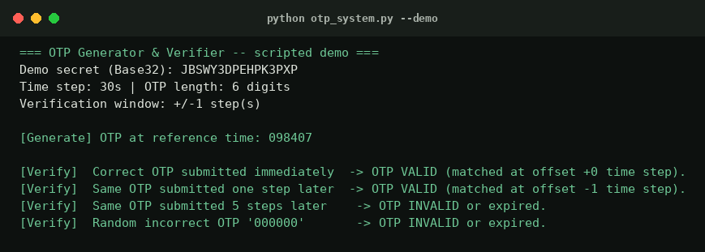

# CS_5_OTPGeneratorVerifier_BYTE

A time-based one-time password (TOTP) generator and verifier built for
**Task 5 — Cybersecurity Track**, AVIP 2026 (B.Y.T.E by Arithmatrix).

Implements the algorithm behind apps like Google Authenticator from first
principles — HMAC-SHA1 + a time-derived counter, per **RFC 4226** (HOTP) and
**RFC 6238** (TOTP) — using only Python's standard library. No third-party
OTP packages.



## How it works

1. A random secret is generated and Base32-encoded (the same format used by
   real authenticator apps, so it's QR/manual-entry compatible).
2. The current Unix time is divided into fixed **time steps** (30 seconds by
   default) to produce a counter.
3. That counter is HMAC-SHA1'd with the secret and truncated (RFC 4226
   "dynamic truncation") into a 6-digit code.
4. Verification recomputes the code for the current time step **and a small
   window on either side**, so a code generated a few seconds ago (or a
   client clock that's slightly off) still verifies — this is exactly how
   real-world MFA systems tolerate clock drift.

## Configuration

Defined in `CONFIG` at the top of `otp_system.py`:

| Setting | Default | Meaning |
|---|---|---|
| `otp_length` | 6 | Digits in the generated OTP |
| `time_step_seconds` | 30 | Validity window per OTP (RFC 6238 default) |
| `verification_window` | 1 | Accepts OTPs from ±1 time step to tolerate drift |

## Usage

**Interactive mode:**

```bash
python otp_system.py
```

Generates a fresh random secret, then lets you generate/verify OTPs against
it from a menu.

**Scripted, reproducible demo** (used to produce the output below and the
screenshot above):

```bash
python otp_system.py --demo
```

### Example output

```
=== OTP Generator & Verifier -- scripted demo ===
Demo secret (Base32): JBSWY3DPEHPK3PXP
Time step: 30s | OTP length: 6 digits
Verification window: +/-1 step(s)

[Generate] OTP at reference time: 098407

[Verify]  Correct OTP submitted immediately  -> OTP VALID (matched at offset +0 time step).
[Verify]  Same OTP submitted one step later  -> OTP VALID (matched at offset -1 time step).
[Verify]  Same OTP submitted 5 steps later    -> OTP INVALID or expired.
[Verify]  Random incorrect OTP '000000'       -> OTP INVALID or expired.
```

Full output: [`samples/demo_run_output.txt`](samples/demo_run_output.txt)

## Test vectors

Six reproducible test vectors (fixed secret + fixed timestamps, so results
never change between runs):

```bash
python test_vectors.py
```

| Case | Expected |
|---|---|
| Correct OTP, submitted immediately | Valid |
| Correct OTP, submitted 1 step (30s) later — within window | Valid |
| Correct OTP, submitted 1 step (30s) earlier — within window | Valid |
| Correct OTP, submitted 5 steps (150s) later — outside window | Invalid |
| Incorrect OTP `000000` | Invalid |
| Empty string submitted | Invalid |

All 6 currently pass. See [`screenshots/demo_test_vectors.png`](screenshots/demo_test_vectors.png).

## Security notes

- OTP comparison uses `hmac.compare_digest` (constant-time) rather than `==`,
  to avoid leaking timing information about how many leading digits matched.
- The verification window is intentionally small (±1 step = ±30s) — widening
  it improves usability but weakens the OTP's replay-resistance, so it's
  exposed as a config value rather than hardcoded, with the trade-off
  documented here.

## Project structure

```
CS_5_OTPGeneratorVerifier_BYTE/
├── otp_system.py            # Core HOTP/TOTP logic + CLI (interactive & --demo modes)
├── test_vectors.py          # Reproducible test suite (6 cases)
├── samples/
│   └── demo_run_output.txt  # Full output of the scripted demo
├── screenshots/
│   ├── demo_run.png
│   └── demo_test_vectors.png
└── README.md
```

## Author

Devansh Shukla — AVIP 2026, Intern ID `arith63342`
